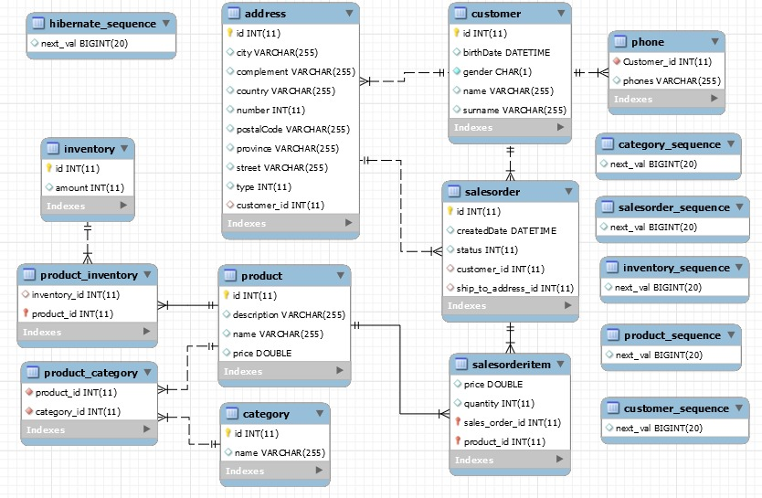

# Trabalho Persistência 34SCJ.

## Integrantes: 

| RM     	| NOME                     	|
|--------	|--------------------------	|
| 334242 	| BRUNO DELPHINO ZAMBOTTI  	|
| 333554  	| DIEGO LANDI RIBEIRO      	|
| 333906 	| EDUARDO MATOSO DE LIMA   	|
| 333792 	| FERNANDA LEMBO VEDOVELLO 	|
| 333788 	| GIOVANI SILVA            	|
| 334110 	| HENRIQUE SUEL DA SILVA   	|
| 334151 	| MARCELO ZANI             	|
| 333515 	| RONALDO CERQUEIRA LEITE   |

## Links:

- ### [Repositório Spring Data JPA](https://github.com/ronaldoleitte1975/trabalho-final-persistencia-34scj)
- ### [Repositório MongoDB](https://github.com/FernandaLV/trabalho-final-persistencia-34scj--mongodb)

## Etapas de produção dos projetos: 

- Modelagem do banco de dados 
- Escolha da opção de solução
- Desenvolvimento das entidades 
- Definição das funcionalidades 
- Definição dos contratos de entrada e saída de informação 
- Desenvolvimento das funcionalidades 
- Testes das funcionalidades  
- Revisão e ajustes 
- Documentação 

## Escolha da solução

a. Spring Data JPA + Cache Redis (os dois em um único projeto).
* __Descartado__: Não identificamos necessidade de cache, exceto para lista de cidades, estados, etc., logo utilizaríamos para uma pequena parte da solução, e não nos foi apresentada necessidade de alta performance, ou grande volume de transações, o que pediria uma solução com cache.

b. Spring Data JPA (em um projeto separado) e Neo4J (em outro projeto separado).
* __Descartado__: Neo4J foi feito para grafos, apesar de conseguirmos modelar, entendemos que não é uma boa aplicação para o nosso problema.

c. Spring Data JPA (em um projeto separado) e MongoDB (em outro projeto separado, sendo
que neste projeto
* __Escolhido__: MongoDB é adequado para a nossa solução, conseguimos usálo bem com a nossa modelagem.

## Funcionalidades:

### Gerenciamentos de clientes

> Consultar todos os clientes

> Consultar um cliente específico  

> Cadastrar um cliente 

> Alterar informações de um cliente 

> Excluir um cliente 

### Gerenciamentos de pedidos

> Consultar todos os pedidos 

> Consultar um pedido específico  

> Realizar um pedido 

> Alterar um pedido 

> Excluir um pedido 

### Gerenciamentos de categorias de produtos

> Consultar todas as categorias  

> Consultar uma categoria específica  

> Cadastro de categorias 

> Alterar uma categoria  

> Excluir uma categoria  

### Gerenciamentos de produtos

> Consultar todos os produtos 

> Consultar um produto específica  

> Cadastro de produtos 

> Alterar um produto  

> Excluir um produto 

### Gerenciamentos de estoque 

> Consultar o estoque 

> Consultar um produto do estoque  

> Alterar um produto do estoque 

> Adicionar um produto ao estoque 

> Excluir um produto do estoque  

## Modelo de Dados:

### Detalhes do modelo:
Um cliente tem seu nome, sobrenome, gênero, e data de nascimento, além disso ele pode ter um ou mais telefones para contato e um ou mais endereços. 

Cada cliente pode ter um ou mais pedidos de vendas, que além de data de criação e situação do pedido, possui um endereço para entrega e um ou mais produtos atrelados. 

Cada item do pedido de venda tem obrigatóriamente um produto associado, assim como a quantidade solicitada e o preço referente ao valor do produto na data de criação do pedido. 

Um produto além de poder estar em um ou mais pedidos, pode também pertencer a uma ou mais categorias. Todo produto ainda tem um nome, descrição, preço e está em um estoque de produtos. 

Por fim, o estoque possui obrigatoriamente todos os produtos e sua quantidade. 

## Outras informações

### Testando a aplicação via Postman:
Para testar os métodos da aplicação via Postman siga os passos a seguir:
1. Realize a instalação do [programa](https://www.getpostman.com/downloads/).
2. Após a instalação abra o aplicativo.
3. Após o aplicativo abrir, siga as seguintes instruções:

    3.1. Clique em **File** no menu de opções.
  
    3.2. Em seguida clique em **Import**.
  
    3.3. Tenha certeza de que a aba **Import File** está selecionada na janela que abrir, caso não esteja selecione-a.
  
    3.4. Clique no botão **Choose Files** na janela que será aberta.
  
    3.5. Escolha o arquivo ***"Trabalho de Persistência - 34SCJ.postman_collection.json"*** presente na raiz do projeto.

4. Agora é só subir a aplicação e realizar as chamadas desejadas.

#### Fluxo recomendado para teste:
Para realizar um teste integrado e completo, um dos fluxos recomendados é o seguinte:

1. Cadastre um categoria de produto, por meio da request do postman *"createCategory"*.

2. Cadastre um produto por meio da request do postman *"createProduct"* passando a categoria criada anteriormente como um dos elementos do corpo da requisição.

3. Adicione o produto criado e a quantidade desejada no estoque por meio da request do postman *"createInventoryItemByProductId"*.

4. Cadastre um novo cliente por meio da request do postman *"createCustomer"*.

5. Gere um pedido, informando o cliente e o produto criados anteriormente, por meio da request do postman *"createSalesOrder"*.

6. Consulte o pedido, por meio da request do postman *"getStalesOrdersById"*, informando o id gerado no passo anterior.

7. Consulte o estoque pelo produto que foi associado ao pedido para verificar que o estoque foi sensibilizado com a efetivação do pedido por meio da request do postman *"getInventoryByProductId"*.

### Tabelas de domínio:

#### Tipo do endereço:

| CÓDIGO 	| DESCRIÇÃO   	|
|--------	|-------------	|
| 1      	| RESIDENCIAL 	|
| 2      	| COMERCIAL   	|
| 3      	| ENTREGA     	|
| 4      	| OUTROS      	|

#### Situação do Pedido:

| CÓDIGO 	| DESCRIÇÃO            	|
|--------	|----------------------	|
| 0      	| NOVO                 	|
| 1      	| AGUARDANDO PAGAMENTO 	|
| 2      	| EM SEPARAÇÃO         	|
| 3      	| EM DESLOCAMENTO      	|
| 4      	| ENTREGUE             	|

### Links:

- #### [Repositório Spring Data JPA](https://github.com/ronaldoleitte1975/trabalho-final-persistencia-34scj)
- #### [Repositório MongoDB](https://github.com/FernandaLV/trabalho-final-persistencia-34scj--mongodb)
